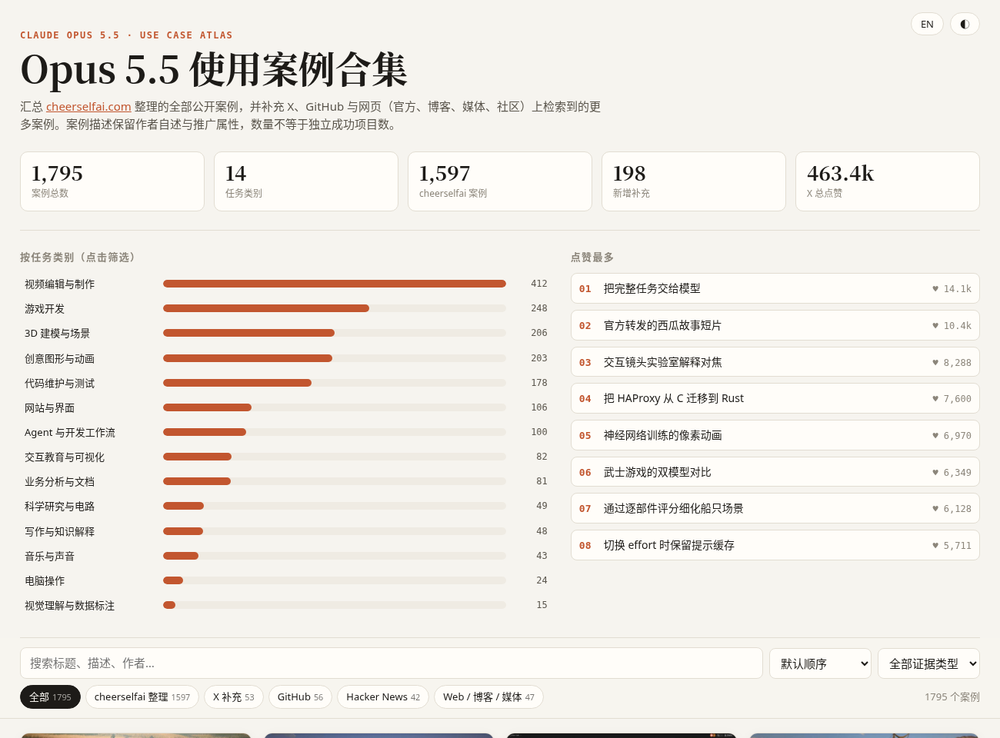

# Claude Opus 5.5 使用案例合集

> Claude Opus 5.5 发布（2026-09-22）后前三天的 **1795 条**公开使用案例，已做结构化整理：包括 [cheerselfai.com](https://cheerselfai.com/usecase/claude-opus-5-5) 收录的全部 1597 条，以及从 X、GitHub、Hacker News 和网页（官方、博客、媒体）补充的 198 条。每条案例都标注了类别、证据类型和原始出处，并附一个可离线打开的单文件浏览页面。

## 效果展示



下载 [`index.html`](index.html) 后直接用浏览器打开（数据已内嵌，无需服务器），页面支持：

- 按标题、摘要、作者全文搜索
- 按 14 个任务类别、5 种证据类型、5 个来源筛选
- 按点赞、收藏或时间排序
- 中英文切换，深浅色主题

## 数据概览

| 来源 | 条数 | 说明 |
| --- | ---: | --- |
| cheerselfai.com | 1597 | 原站全部案例，含中英文标题与摘要、点赞与收藏数、封面图 |
| X（补充） | 53 | cheerselfai 未收录的推文，偏评测数据与产品集成 |
| GitHub | 56 | 仓库、Issue、PR：用 Opus 5.5 构建的项目、评测仓库、兼容性问题 |
| Hacker News | 42 | 评论与帖子，只保留有具体任务和结果的第一手经验 |
| Web | 47 | Anthropic 发布页的客户案例、公司博客、媒体报道、Qiita / Zenn / note、中文媒体 |

| 任务类别 | 条数 | 任务类别 | 条数 |
| --- | ---: | --- | ---: |
| 视频编辑与制作 | 412 | 交互教育与可视化 | 82 |
| 游戏开发 | 248 | 业务分析与文档 | 81 |
| 3D 建模与场景 | 206 | 科学研究与电路 | 49 |
| 创意图形与动画 | 203 | 写作与知识解释 | 48 |
| 代码维护与测试 | 178 | 音乐与声音 | 43 |
| 网站与界面 | 106 | 电脑操作 | 24 |
| Agent 与开发工作流 | 100 | 视觉理解与数据标注 | 15 |

证据类型：演示 980 · 评测 416 · 集成 220 · 教程 100 · 限制 79

## 值得一看的案例

**工程与企业**
- 把 HAProxy 从 C 迁移到 Rust：[Anthropic 发布页](https://www.anthropic.com/claude-opus-5-5)称用时 9.5 小时，回归测试全部通过（相关讨论见 [@bcherny](https://x.com/bcherny/status/2102439069053747549)）。
- Stripe：据 [Anthropic 发布页](https://www.anthropic.com/claude-opus-5-5)的客户引述，一次会话 rebase 了 40 个堆叠 PR，全部通过 CI。
- [Box](https://blog.box.com/claude-opus-55-faster-and-leaner-high-quality-work)：token 用量约为 Opus 5 的三分之一，技术类任务准确率从 63% 升到 74%。

**长时间自主运行**
- [24 小时从零写出国际象棋引擎](https://github.com/stevemaughan/opus-5.5-chess-24hrs)：作者称约 3463 Elo。
- [一条提示生成 5 分钟讲解视频](https://news.ycombinator.com/item?id=49837060)，并自动上传到 YouTube。

**创作**
- [一条提示生成 Wasmer 发布视频](https://news.ycombinator.com/item?id=49837469)：HTML 动画加 ffmpeg 录制，替代原本 6–12 小时的手工制作。
- [读懂 1819 年博斯普鲁斯古地图](https://cahidarda.com/articles/bosphore-1819)：子代理识别、定位并翻译了 387 个标注。

**局限**
- max 档可能用满 128k 输出 token 仍未作答，见 [Simon Willison](https://simonwillison.net/2026/Sep/22/opus-and-sol-and-luna/)。
- 网络安全与生物类问题会被安全分类器误拒（数据里有多条「限制」类案例）。
- [Vals AI](https://www.vals.ai/models/anthropic_claude-opus-5-5)：综合指数第一，但法律 agent 任务表现较弱。

> 完整清单请看 `index.html`，或筛选「限制」证据类型。

## 数据格式

`data/all_cases.json`：`{ "meta": {...}, "cases": [...] }`，每条案例的字段如下：

| 字段 | 说明 |
| --- | --- |
| `id` / `source` | 唯一 ID；来源为 `cheerselfai` / `x` / `github` / `hn` / `web` |
| `platform` | 出处平台，如 X、GitHub、Hacker News、Anthropic、Zenn |
| `category` | 14 个任务类别之一，中英文名称见 `meta.categories` |
| `evidenceType` / `evidenceType_en` | 演示 / 评测 / 集成 / 教程 / 限制 |
| `title` / `title_en`, `summary` / `summary_en` | 中英文标题与摘要 |
| `author`, `sourceUrl`, `date` | 原作者、原始链接、发布日期 |
| `likes`, `bookmarks`, `stars` | X 点赞与收藏（仅 cheerselfai 部分）；GitHub star 数 |
| `mediaKind`, `poster`, `video` | 媒体类型与原始媒体链接（直接引用原站，不在本仓库存储） |

其他文件：`cheerselfai_cases.json` / `.csv` 是原站部分（CSV 可直接用 Excel 打开）；`extra_*.json` 是各补充渠道的原始整理结果。

## 复现步骤

```bash
cd cases/models/claude-opus-5-5-usecases
python3 scripts/fetch_cheerselfai.py      # 抓取 cheerselfai 中英文数据 -> data/_raw_cheerselfai.json
python3 scripts/normalize_cheerselfai.py  # 规范化 -> data/cheerselfai_cases.json / .csv
python3 scripts/build_html.py             # 合并 extra_*.json 并去重 -> data/all_cases.json + index.html
```

只依赖 Python 3 标准库。几点实现说明：

- cheerselfai 页面服务端只渲染前约 20 条，但全部案例都内嵌在 Next.js 的 RSC payload（`self.__next_f.push`）里，脚本直接从中解析。
- 补充部分由 Claude Opus 5.5 驱动的检索子代理完成：X 与网页靠 Web 搜索，GitHub 靠 `gh search` 和 Web 搜索，Hacker News 靠 Algolia API。只收录在搜索结果或抓取页面中实际出现过的链接。
- 去重规则：推文按 URL 去重，忽略查询参数；其他来源按 URL 加标题去重，因为同一页面（如发布页）可能包含多个独立案例。

## 成本与性能

- 抓取与构建：几秒钟。
- 补充检索：5 个子代理，每个 5–10 分钟。
- `index.html` 约 1.4 MB，采用滚动懒加载，千余条数据在手机上也能流畅浏览。

## 局限与风险

- **案例数不等于成功项目数**：大量案例是平台推广或作者自述，摘要中已尽量标注"作者称""平台推广"。
- **X 补充部分依据搜索摘要**：X 不支持直接抓取推文，这部分没有读过原文全文。3 条 YouTube 条目只依据视频标题，部分中文媒体报道属二手转述。
- **覆盖不全**：知乎、Reddit 无法抓取，基本未收录。
- **时效**：数据截至 2026-09-25（发布后约 3 天）。cheerselfai 仍在持续更新，可重新运行脚本获取最新数据。
- **媒体链接可能失效**：封面图与视频直接引用 twimg 等原站地址，原帖删除后会失效。

## 参考资料与致谢

- 案例库主要来源：[cheerselfai.com · Claude Opus 5.5 使用案例](https://cheerselfai.com/usecase/claude-opus-5-5)（林悦己）。其标题与摘要的版权归原站所有。
- 官方发布：[Anthropic · Claude Opus 5.5](https://www.anthropic.com/claude-opus-5-5)
- 各案例版权归原作者所有，请以 `sourceUrl` 指向的原帖为准。
